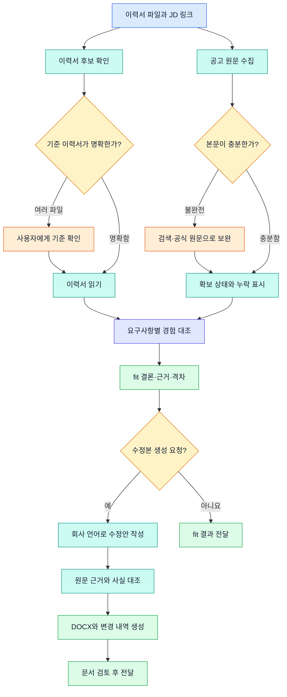
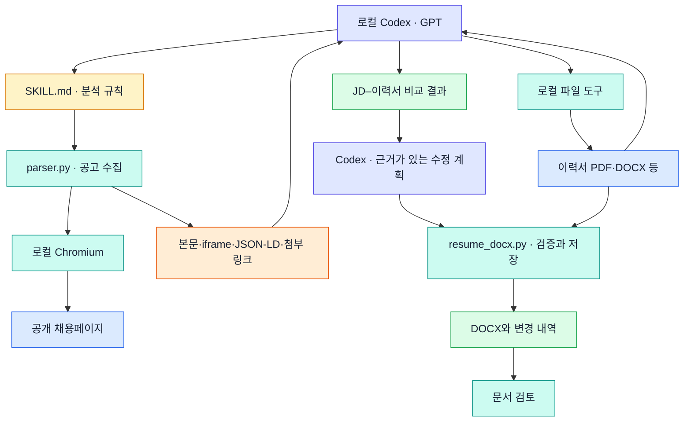

# JDanalysis

이력서와 채용공고를 나란히 읽고, 이 직무에 지원할 근거가 있는지 판단하는 로컬 Codex 스킬입니다.

공고에 같은 단어가 있다는 이유만으로 적합하다고 보지는 않습니다. 실제로 맡았던 역할, 업무 범위, 성과를 요구사항과 비교합니다. 이력서에 없는 내용은 `미확인`으로 남깁니다. `미기재`와 `미충족`은 다릅니다.

별도 서버나 OpenAI API 키 없이 사용합니다. 공고 수집은 로컬 Python·Playwright가 맡고, 분석은 Codex에서 선택한 GPT 모델이 수행합니다. Codex 이용 한도는 적용됩니다.

## 설치

Python 3.10 이상과 로컬 Codex가 필요합니다. 설치 과정에서 Python 패키지와 Chromium을 다운로드합니다.

### macOS

```bash
git clone https://github.com/isaaskywalker/JDanalysis.git
cd JDanalysis
bash install.sh
```

macOS에서 `python3`가 3.9.6이라면 새 Python을 설치한 뒤 해당 실행 파일을 지정합니다.

```bash
brew install python@3.12
JOB_PARSER_PYTHON="$(brew --prefix python@3.12)/bin/python3.12" bash install.sh
```

### Windows

Python 3.10 이상과 Git을 설치하고 PowerShell에서 실행합니다. 저장소의 **Code → Download ZIP**으로 내려받아 압축을 풀었다면 clone 단계는 생략합니다.

```powershell
git clone https://github.com/isaaskywalker/JDanalysis.git
cd JDanalysis
powershell -NoProfile -ExecutionPolicy Bypass -File .\install.ps1
```

실행 정책 예외는 이 명령으로 시작한 PowerShell 프로세스에만 적용됩니다. 시스템 정책은 변경하지 않으며 관리자 권한을 기본 요구하지 않습니다. 조직 정책이 실행을 차단하면 해당 정책을 따라야 합니다.

Python을 자동으로 찾지 못하면 설치한 실행 파일을 지정합니다.

```powershell
powershell -NoProfile -ExecutionPolicy Bypass -File .\install.ps1 -PythonPath "C:\경로\python.exe"
```

설치가 끝나면 macOS와 동일하게 로컬 Codex에서 저장소 폴더를 열고, 이력서를 넣은 뒤 JD 비교를 요청합니다. 가상환경 활성화는 필요하지 않습니다.

| 운영체제 | 설치 파일 | parser에 사용하는 Python |
|---|---|---|
| macOS | `install.sh` | `.venv/bin/python` |
| Windows | `install.ps1` | `.venv\Scripts\python.exe` |

설치가 끝나면 로컬 Codex에서 **이 저장소 폴더**를 엽니다. 브라우저 실행이 Codex의 제한된 실행 환경에서 막히면 실제 오류를 확인하고, 해당 실행에 필요한 승인을 진행합니다. 권한 오류와 사이트 접근 차단은 구분해야 합니다.

## 사용

1. `resumes/`에 이력서를 넣습니다. PDF·DOCX·TXT·MD·이미지 파일을 사용할 수 있습니다.
2. Codex에 공고 링크를 보내고 비교를 요청합니다.

```text
채용공고 분석 스킬을 사용해서 resumes 폴더의 이력서와 아래 JD를 비교해줘.
이 직무에 fit한지, 필수 조건을 충족하는지, 어떤 근거가 부족한지 알려줘.

[채용공고 URL]
```

이력서가 여러 개면 기준 파일을 확인합니다. 원본 파일은 수정하지 않습니다. PDF·DOCX 판독은 Codex의 파일 도구를 사용하며, parser가 이력서를 직접 추출하는 구조는 아닙니다. 스캔 문서를 읽을 도구가 없으면 그 부분은 판단을 보류합니다.

`install-job-parser-mac.command`는 저장소를 내려받기 전에 사용할 수 있는 독립 설치 파일입니다. 기본 설치 위치는 `~/Documents/JobPostingGPT`입니다. 저장소를 clone했다면 `install.sh`를 사용하면 됩니다.

## 회사별 이력서 DOCX 생성

fit 분석 이후 회사의 업무 표현에 맞춘 수정본을 생성합니다. Codex에 “이력서와 JD를 비교한 뒤 회사별 이력서 DOCX와 변경 내역을 만들어줘”라고 요청하세요.

- DOCX 원본은 문단 단위로 수정해 문단·표·페이지 설정을 유지합니다. 수정 문단의 혼합 서식과 페이지 나눔은 달라질 수 있습니다. 그림·필드·하이퍼링크가 있는 문단은 자동 수정하지 않습니다.
- PDF·이미지는 읽은 내용을 새 DOCX로 재구성합니다. 원본 디자인을 복제하지 않습니다.
- 원본은 유지하고 results/ 아래에 회사명_직무명_이력서.docx와 회사명_직무명_변경내역.md를 생성합니다.
- 원문 인용과 숫자를 검사하며, Codex가 책임 범위·성과·누락 등 의미상 일치도 검토합니다. 경험이나 수치를 새로 만들지 않습니다.
- JD가 불완전하거나 이력서를 못 읽으면 생성을 보류합니다. 낮은 fit이나 필수 조건의 격차를 문구 수정으로 감추지 않습니다.
- 렌더링 도구가 있으면 모든 페이지를 시각 검토합니다. 없으면 시각 검증 미완료를 알리고 Word에서 확인하도록 안내합니다.

기존 설치는 git pull 후 install.sh 또는 install.ps1을 다시 실행해 DOCX 의존성을 추가하세요. 독립 macOS .command 파일은 초기 fit 분석용 패키지이므로 최신 DOCX 기능은 저장소 설치 파일을 사용합니다.

## 워크플로우



공고가 없거나 이력서를 읽지 못했으면 개인 적합성을 만들어내지 않습니다. 일부만 읽었다면 결론도 잠정으로 표시합니다.

## 분석 기준

| 단계 | 확인하는 내용 |
|---|---|
| 업무 우선순위 | 첫 항목, 반복, 강조, 필수 조건을 바탕으로 중요한 업무를 추정하고 경험을 대조 |
| 하드·소프트 스킬 | 직무와 연차에 맞춰 실제 수행 역량과 협업 역량을 분류 |
| 회사 언어 | 공고의 표현을 요구 범위와 수준으로 풀어 이력서 경험과 비교 |
| 검증 질문 | 이 일을 할 수 있는지, 어느 경험이 근거인지, 무엇이 미확인인지 확인 |
| 크리티컬 히트 포인트 | 적합성을 뒷받침하는 결정적 경험을 한 문장으로 정리 |

공고의 첫 업무가 항상 가장 중요하다고 단정하지 않습니다. 우선순위는 원문에 명시된 사실과 분석자의 추정을 구분합니다. 포트폴리오 배치나 문구 작성은 별도 요청이 있을 때만 합니다.

## 결과

결론은 `적합`, `조건부 적합`, `현재 근거로 적합성 낮음`, `판단 보류` 중 하나로 제시합니다. 업무 수행 적합성과 명시적 지원 자격 충족을 따로 봅니다.

비교표에는 다음 항목이 들어갑니다.

| JD 요구사항 | 업무·필수·우대 | 중요도 | 이력서 근거 | 판정 | 차이·추가 확인 |
|---|---|---|---|---|---|
| 원문 기준 | 조건 구분 | 명시 또는 추정 | 파일·페이지·경험 | 충족 / 부분 충족 / 미확인 / 미충족 | 결론을 바꿀 수 있는 내용 |

이어서 핵심 강점, 실제 격차, 확인 질문, 지원 판단을 정리합니다. 합격 확률이나 근거 없는 백분율은 제시하지 않습니다.

## 아키텍처



- **수집:** Python parser가 원본 URL과 추적 파라미터를 정리한 URL을 시도합니다. 사람인의 `rec_idx`와 일반 사이트의 기능 파라미터는 보존합니다.
- **렌더링:** Playwright가 Chromium을 실행하고, 제한된 스크롤로 지연 로딩을 유도합니다. DOM과 최대 20개 frame에서 내용을 수집합니다.
- **검증:** parser의 키워드 검사는 영역이 있는지 알려주는 힌트입니다. 전문 확보 여부는 Codex가 실제 내용을 확인한 뒤 판정합니다.
- **분석:** 스킬 지침에 따라 JD와 이력서를 비교합니다. 판정은 모델의 해석이므로 같은 입력에서도 결과가 달라질 수 있습니다.
- **연결:** 기본 경로는 로컬 스크립트 호출입니다. 원격 MCP나 상시 실행 서버는 필요하지 않습니다. 선택적 stdio MCP 진입점은 소스에 있지만 기본 설치에는 MCP 패키지를 설치하지 않습니다.

DOCX 생성은 [resume_docx.py](.agents/skills/job-posting-analysis/scripts/resume_docx.py)가 맡고, [생성 계약](.agents/skills/job-posting-analysis/references/resume-docx.md)에 따라 Codex가 수정 계획을 작성합니다.

핵심 파일은 [분석 스킬](.agents/skills/job-posting-analysis/SKILL.md), [공고 parser](.agents/skills/job-posting-analysis/scripts/parser.py), [실행 안내](.agents/skills/job-posting-analysis/references/parser-runtime.md)입니다.

## 현재 범위와 제한

- 잡코리아·사람인 URL을 식별하고, 다른 공개 HTTP(S) 페이지에도 공통 추출을 시도합니다. 모든 사이트의 성공을 보장하는 사이트별 상세 parser는 아닙니다.
- 긴 이미지와 PDF 링크를 찾아 반환합니다. 자동 OCR·PDF 본문 추출은 parser에 포함되지 않습니다. Codex의 별도 도구로 읽어야 합니다.
- 로그인·CAPTCHA·접근 차단을 우회하지 않습니다. 페이지가 막히면 검색 또는 공식 채용 원문으로 보완하고, 실패한 부분은 표시합니다.
- 원격 서버용 인증·요청 제한·격리 환경은 구현하지 않았습니다. 이 코드를 공개 HTTP 서비스로 그대로 노출하는 용도가 아닙니다.
- 로컬 실행은 공고 수집이 PC에서 이루어진다는 뜻입니다. Codex 분석까지 오프라인으로 처리된다는 뜻은 아닙니다.

## 검증 상태

URL 정규화, 사람인 공고 ID 보존, 기능 파라미터 유지, 보수적인 완전성 판정은 자동 테스트로 확인했습니다.

```bash
python3 -m unittest discover -s tests -v
```

개발 환경에서는 Chromium 다운로드가 실패해 실제 잡코리아·사람인 공고의 전체 수집을 검증하지 못했습니다. macOS·Windows 설치와 이력서 대조도 아직 전체 과정을 검증하지 못했습니다. Windows 설치 파일의 실제 PowerShell 실행은 개발 환경에서 확인하지 못했습니다. `install.sh`의 브라우저 확인은 실행 가능 여부를 검사하며, 채용 사이트 접근 성공까지 보장하지 않습니다.

DOCX 재구성·문단 수정, 원본 보존, 근거 오류·신규 숫자·불완전 JD 거부의 테스트 5개가 통과했습니다. 한글 샘플 DOCX를 렌더링해 글자와 배치를 확인했습니다. 실제 지원자의 문서와 macOS·Windows 전체 실행은 별도 검증이 필요합니다.

## 이력서 관리

이력서는 `resumes/`에 두는 것을 권합니다. 이 폴더, PDF·DOCX, 실행 환경과 결과 폴더는 `.gitignore`에서 제외합니다. TXT·MD 이력서를 저장소 최상위에 두면 Git이 추적할 수 있으니 커밋 전에 파일 목록을 확인하세요.

이 프로젝트는 이력서를 따로 외부 서비스에 업로드하는 기능을 포함하지 않습니다. Codex에 제공한 내용은 사용하는 Codex 환경의 데이터 처리 정책을 따릅니다.
